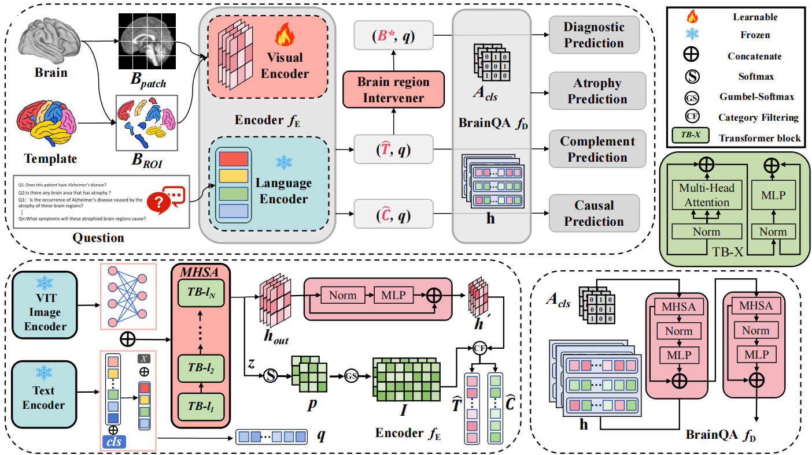
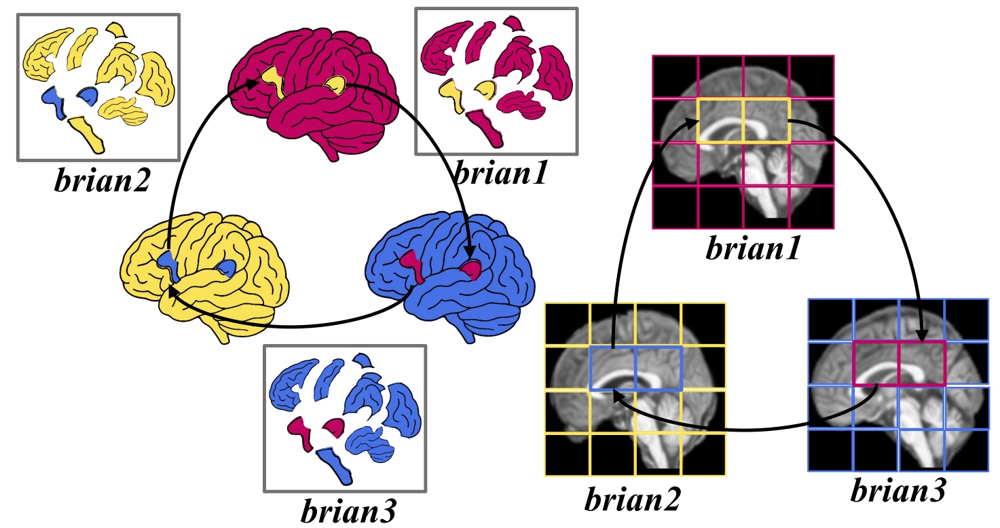
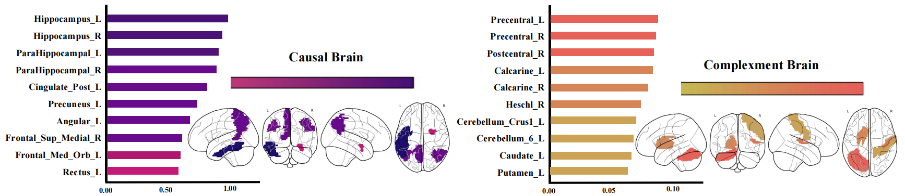

# BrainQA:Transformer-Driven Invariant Grounding for 3D Brain imaging Question Answering

## Usage
### 1、Data
Including ADNI, OASIS and AIBL

### 2、Preprocessing
All MRI images undergo standardized preprocessing to ensure anatomical consistency across subjects and datasets. First, non-brain tissues are removed using the Brain Extraction Tool, followed by spatial normalization to the MNI152 template with 1 mm isotropic resolution. Intensity non-uniformities are corrected via N4 bias-field correction, and the resulting images are visually inspected for quality control. Subsequently, each preprocessed MRI volume is segmented into 32 anatomical regions of interest using the atlas, which provides the anatomical basis for generating the atlas-level ROI tokens Batlas.

### 3、Run
run 'model_train.py'. (The code for the model module will be open-sourced during the manuscript accepted.)

### 4、Model
model:

A Region Intervener to regularize the grounding process:

The top-10 causal and complementary brain regions identified by BrainQA for Alzheimer’s disease-related questions, ranked by the grounding indicator’s attention scores.:

